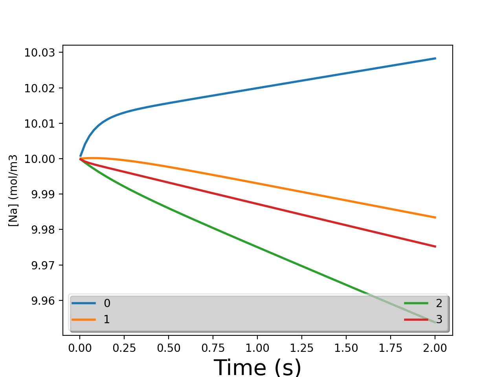

# Assignments

## Lab 1 - Report
1. 
The system is in steady state at the end of the simulation becuase the ionCh and pump values even each other out. Only the K ion has a slight difference of -1 across all cells. It means that as many ions come in as get pumped out.
```
Na ionCh: [ 254  254  254  254] mol/m3s*10^4
Na pump:  [-254 -254 -254 -254] mol/m3s*10^4
K  ionCh: [-170 -170 -170 -170] mol/m3s*10^4
K  pump:  [ 169  169  169  169] mol/m3s*10^4

Totals by ion from all sources:
K  total: [  -1   -1   -1   -1] mol/m3s*10^4
```

2. 
2a) We made the assumption that the ECF is too big to be affected by anything. Because each ion will eventually approach the membrane potential of -70mV and we treat the outside as a fixed constant, it doesn't matter how high the internal concentration is.

2b) I would expect diffusion to be less strong because the difference between external and internal concentrations is now smaller. I would expect drift to remain unchanged. Perhaps if they enter slower, the pump will remove more in the meantime and they will end up equal.

2c) Given that we assumed the external concentration to be fixed, once cells #1-3 have reached the cell-internal ion concentrations they would reach the same SS solution.

2d)
0 = G_Na * (Vmem - V_Na) + j_pump_Na
0 = G_K * (Vmem - V_K) + j_pump_K
0 = G_Cl * (Vmem - V_Cl)
Q = CV; Q = [Na] + [K] - [Cl]; C = constant 
-> [Na] + [K] - [Cl] = Vmem
4 equations, 4 unknowns, nothing else plays a part including the initial ion concentrations hence they are irrelevant

3. 
Nernst Potential for Cl
Initial
Cl_in = 55, Cl_out = 140

Final
Cl_in = 22, Cl_out = 140

Nernst = 48mV
Vmem = 49.8mV

It does roughly agree with the Vmem potential because in the case of Cl there is no ion pump so diffusion == drift.

4. 
4a) 
Net (drift + diffusion) flow
Na: inwards, K: outwards, Cl: zero
Increasing D means decreasing the resistance as D is the inverse resistance. Hence, when we decrease the resistance more ions will flow through the channels pulling  the Vmem more towards their Nernst potential. This is why the overall Vmem increases for Na (Nernst = 77mV), decreases for K (-89 mV) and stays the same for Cl (71 mV).

4b) Both drift and diffusion double. Because they are equal and opposite they are still balanced and even each other out therefore it's not visible in the Vmem outcome.

4c) When we increase the conductance we decrease the resistance which decreases the voltage at the respective resistor. This makes the ICF voltage more similar to the individual voltages at the ion channels. Therefore the results make sense.

## Lab 2 - Report
1.
As shown below each cell has reached quasi steady state because the net flux is equal to 0 (last row) but the individual ions are unbalanced and their concentrations are still changing as can be seen in .
```
Vm =      [44.2 13.3 -57.0 -82.0]mV
Na ionCh: [ 580  397  279  372] mol/m3s*10^4
Na pump:  [-497 -493 -490 -492] mol/m3s*10^4
K  ionCh: [-203 -124 -190 -333] mol/m3s*10^4
K  pump:  [ 331  328  326  328] mol/m3s*10^4
Cl ionCh: [ 212  108  -74 -125] mol/m3s*10^4

Totals by ion from all sources:
Na total: [  83  -96 -211 -119] mol/m3s*10^4
K  total: [ 128  204  137   -5] mol/m3s*10^4
Cl total: [ 212  108  -74 -125] mol/m3s*10^4

Grand valence-weighted totals from all sources across all ions:
          [  -0    0    0    0] mol/m3s*10^4
```

2. 
Calculation:
```
F = 96485 C/mole (amount of electricity carried by 1 mole of electrons)
r_cell = 5.0e-6 m
r_vol = 5.236e-16 m^3
c_patch = 0.05 F/m^2
c_cell_mem = 1.57e-11 F
flux = 85*10^-3 mol/m^3s

current = 85*10^-3 mol/m^3s * 5.236e-16 m^3 * 96485 C/mole
current = 4.29 e-12 C/s

Q = CV -> c is a constant
dQ/dt = C * dV/dt
dV/dt = 1/C * dQ/dt -> dQ/dt is current because I = Q/t
dV/dt = 4.29 e-12 C/s / 1.57e-11 F
dV/dt = 273 mV/s`
```

3. 
Vm =      [44.2 13.3 -57.0 -82.0]mV
Na IC Vn =[  71   71   72   71]mV
Na IC Gth=[ -38  -10   -2   -2]mol/m3s*10^4/mV
K  IC Vn =[ -86  -86  -86  -86]mV
K  IC Gth=[  -2   -2  -23 -369]mol/m3s*10^4/mV
Cl IC Vn =[ -25  -25  -25  -25]mV
Cl IC Gth=[   3    3    3    3]mol/m3s*10^4/mV

Cell 1: ended up more positive (pulled towards Vnernst of Na) because the conductance of Na conductance was the strongest
Cell 2: ended up less positive than #1 (pulled towards Vnernst of Na) but still positive because Na conductance was the strongest
Cell 3: ended up quite negative (pulled towards Vnernst of K) because K conductance was the strongest
Cell 3: ended up very negative, almost equal to Vnernst of K because K conductance was the strongest
This makes sense because according to Ohm's law, increasing the conductance, decreases the resistance and will pull Vmem more towards the voltage at the decreased resistance.

4. 
Vm =       -57   mV
Na IC Vn    72   mV
Na IC Gth:  -2   mol/m3s*10^4/mV
Na pump:  -490   mol/m3s*10^4
K  IC Vn : -86   mV
K  IC Gth: -23   mol/m3s*10^4/mV
K  pump:   326   mol/m3s*10^4
Cl IC Vn : -25   mV
Cl IC Gth:   3   mol/m3s*10^4/mV

```
0 = I_K + I_Na + G_Na(V_Na - V_mem) + G_K(V_K - V_mem) + G_Cl(V_Cl - V_mem)
0 = 32.6 - 49 + 0.2(72+57) - 2.3(-86+57) + 0.3(-25+57)
0 = 32.6 - 49 + 25.8 - 66.7 + 9.6
0 = -47.7

Na is flowing into the cell -> +
K is flowing out of the cell -> -
Cl is flowing out of the cell -> +
```

5. 
They did all move to the same Vmem of about -57mV. Less internal Na makes V_Na more positive which makes Vmem more positive. The greater difference between Na's outside and inside concentrations increase the diffusion and more V_Na is flowing into the cell. The increased Vmem causes the drift of Na to also increase which is why we quickly get back to normal concentrations and reach QSS.
The final Vmem depends on only two things: ion channel conductances G and Vnernst. The initial concentration only matter because they affect Vnernst but because the changes we made were so small their effect on Vmem shouldn't have been noticeable.

## Lab 3 - Report
I found this video helpful to understand the Hodgkin-Huxley equation better: https://www.youtube.com/watch?v=88tKZLGOr3M
And this one to get an intuition: https://www.youtube.com/watch?v=XsoPVwqv99o

1. 
When Tau_h and Tau_n get increased, they will open slower (their slope towards <>_inf is not as steep). This means they will kick in later in the process, pulling the overall Vmem more towards V_Na (more positive).

2. 
When Tau_m gets increased it will take longer for the m open, while n and h open at the same speed. This has the effect that the overall Vmem of #4 won't be as high as in #1 because less Na ions will get out of the cell before h shuts down the channel and n (K ions) work against the positive Vmem.

3. 
Increasing Tau_n widens the spike because it means that the K channels will open slower and it will take more time until enough K ions can flow out of the cell to bring Vmem back to a negative value. The biological benefit of having a narrower spike is that more signals can be sent in total. The Vmem takes longer to go back to a negative value and a low value is required for the h channel to open again, allowing another action potential to be triggered. If the spike is too narrow it will eventually disappear. If the K channels would open as fast as the Na channels, we simply wouldn't get an AP.

4. 
Initially m and n are closed and h is open. Once the cell reaches a certain Vmem value both m and n open, n slower than m (guided by the time constant). While m is open Na ions flush into the cell making the inside more positive which raises Vmem. A more positive Vmem causes h to close which effectively closes Na channels and no Na ions will leave the cell anymore. At around this point in time n will be fully open and K ions will leave the cell, making the inside more negative and pulling Vmem closer and closer to its own V_K (which is very negative). After a certain threshold m will open again but h will still be closed, allowing no Na ions to flow. This is how we get the refractory period in which Vmem is almost completely controlled by V_K. Then, h opens again and we return to the initial Vmem value.